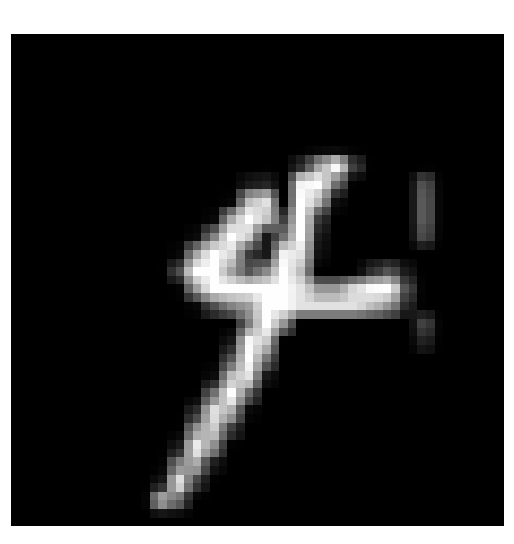
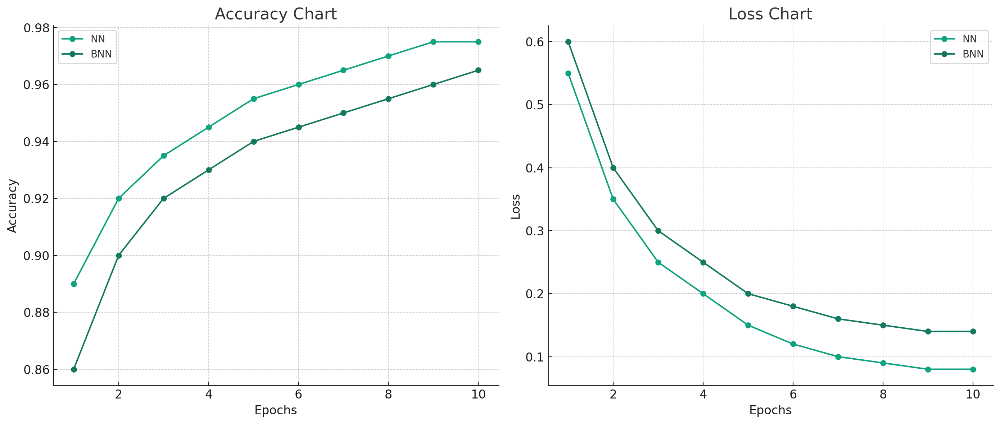
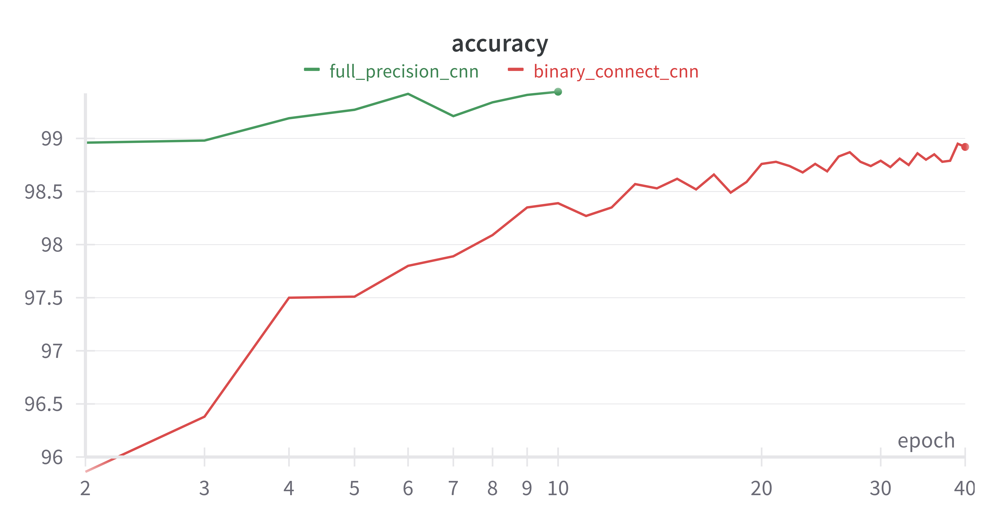
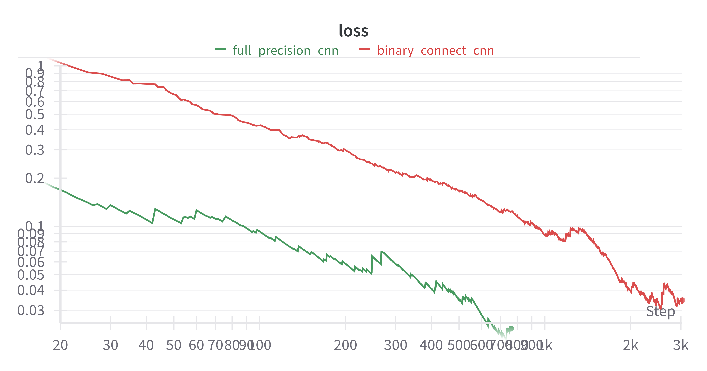
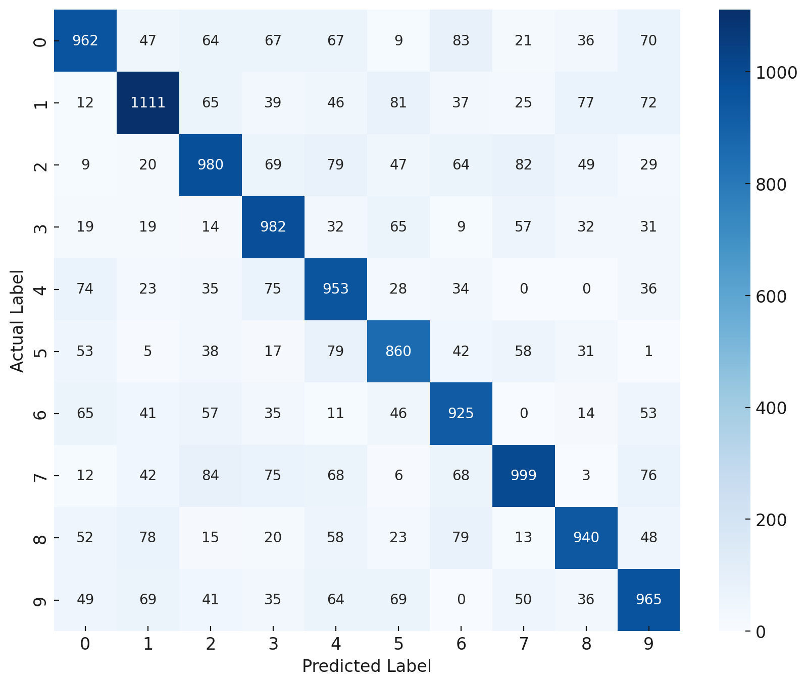

# ML-7641 Binarized Neural Networks
<!-- >How far can you go on datsets like MNIST with neural nets of 1s and 0s -->

### Fall'23: Project Proposal - Group 49
All Code open-sourced and available at our [Github Repository](https://github.com/10-zin/binarized-neural-networks)

# Team Members
Members names orderd in Lexicographically ascending order.

| Member Name                      | Student-Id (@gatech.edu) |
|----------------------------------|----------------|
| Gaurang Kamat                    | gkamat8        |
| Oscar Laird                      | olaird3        |
| Somu Bhargava                    | bsomu3         |
| Sri Kamal                        | schillarage3   |
| Tenzin Bhotia                    | tbhotia3       |

# Table of Contents
1. [Introduction](#introduction)
2. [Problem Definition ](#problem-definition)
3. [Methods](#methods)
4. [Dataset](#dataset)
5. [Potential Results and Discussion ](#potential-results-and-discussion)
6. [Timeline](#timeline)
7. [Member Contributions](#member-contributions)
8. [References](#references)

# Introduction 

As Neural Networks have grown increasingly capable, their memory and compute footprint has grown at a commensurate pace. To reduce the time taken to train and to reduce the memory and storage requirements, we propose the use of binarized neural networks. The basic idea is that instead of using a 32-bit floating-point value to represent a single weight, we will use one bit to represent it. We also aim to binarize the input so that we can replace expensive matrix multiplication with logical AND operation. Since we are exploring a novel problem, we wanted to use a standard dataset like MNIST so that we can compare our work with popular benchmarks. 

# Problem Definition 

A standard operation when training a neural network of any kind is to multiply the weights with input and add bias. If we assume a neural network with 784 nodes in a single layer, and a flattened MNIST image of size 784 as input, to store them as float 32 objects, we will use 50,176 bits to represent the data. If we instead use binary inputs and weights, we can cut it down to 1568 bits. That is a 32x reduction in memory usage. In addition, a logical AND operation is much faster than a dot product. This means that a binary model should, in theory, be smaller and faster to train and run. We aim to test this hypothesis by developing several models with and without binary quantization and observe if our hypothesis holds true. 

# Dataset 

We will be using [MNIST](https://knowyourdata-tfds.withgoogle.com/#tab=STATS&dataset=mnist) dataset for this project. MNIST is a dataset of 60,000 handwritten digits that is commonly used for training various image classification systems. Data visualized below. 

 

# Methods 

We will first implement a simple K-means classifier with K set to 10 to get an idea of the data, and log examples where k-means struggles to classify a given example. We will also implement feed forward neural networks, convolutional neural networks, Logistic Regression and Transformers and implement binarized versions (using techniques like quantization and binary connect) in each of the above models. We will then compare model accuracy, size, time taken to train, time to classify an input example and present this information in our final writeup. 

## Exploratory Data Analysis of MNIST

We start with some preliminary visualizations and analysis of the MNIST Data. 
Majorly we would like to understand if a mere clustering classification can help us form good clusters. And if not, then what are the digits that often look like another digit. 

First, we sample 10 images for each label, and visualize them as shown below.

Each image is a 28*28 single channel numpy array. To make things simpler for visualizations, we apply dimensionality reduction and bring down each image to a 2 dimensional feature. We use t-SNE (t-distributed Stochastic Neighbor Embedding) for an unsupervised non linear dimensionality reduction.

After fitting to the 100 samples from MNIST, we obtain the following visualization

### The Eye Test

Before doing anything complex, we proceed with a simple eye test. We clearly observe some distinct clusters being formed. For instance, digits 0, 6, 8, and 9 form clear clusters, and are easily distinguishible. However, digits 1, 7, 3, 4, 5, and 2 are overall quite scattered. Notably, the digit 2 is the most scattered spanning the entire t-SNE componenet 1 axes, and invading clusters of other digits.

This clearly indicates, that while MNIST is considered a simple dataset, it is not as simple to be easily modelled by a non-paramterized clustering mechanism.

### Diving Deeper

We dive deeper into why some of these digits get miss-classified so often. To do that we locate the digits that get missclassified, and subjectively compare their images in juxtapostion with the other digit in cluster. 

We isolate the following local missclassified regions in the t-SNE plot

Juxtaposing confusing miss-classified images,

2 vs 7:

 

4 vs 9:

 

1 vs 2:

 

These indicate some interesting aspects of the MNIST dataset. We find that basic clustering mechanishm are sub-par for MNIST, and espcially get confused in somewhat similar looking digits. In future we can curate test-sets paticularly around such edge-cases. This can help us evaluate our future models on tail-end edge case inputs.

Next, we move on to parametric approaches for MNIST classification.

## Models and Comparisons
Our main aim is to compare the difference between full precision and binarized variants of those models. Thus, we develop a full-precision Neural Network (Multi-Layer Perceptron) Model, and its binarized variant. We also develop a full-precision Counvolutional Neural Network model for our comparisons.

1. **Data Preparation:** 

   - The MNIST dataset is loaded, which contains 60,000 training images and 10,000 test images of handwritten digits, each of size 28x28 pixels. 

   - The labels (digits 0-9) are converted to one-hot encoded vectors.
        - Why? We use cross-entropy loss. Thus, all labels that are incorrect must be 0 probability. This way even a slight probability for an incorrect label prediction gets penalized by its difference from a 0 porbability. On the other hand, it enforces the prediction for correct digit to be closer to 1, which is what we want.

   - The image data is normalized by dividing by 255, so pixel values are in the range [0, 1]. 
        - Why? Normalizing the pixel values to a smaller range (e.g., 0 to 1) makes the network's training more efficient and stable. 
        This centers our datapoints to a mean of 0.5 with a std. deviation of 0.5, forming easier manifolds for the model to find global minima. This also avoids gradient explosion, as the numbers are b/w 0-1 instead of larger like 255.

   - The images are reshaped from 28x28 matrices to flattened 784-element vectors. 
        - Why? This is done to transform a 2D matrix formatted image, to a 1D vector input that a linear layer of a neural network expects.

2. **Model Architecture:** 

   - Full-Precision MLP
        - A Sequential model is used, which is a linear stack of layers in Keras. 

        - The model consists of two dense (fully connected) layers with 128 units each and ReLU (Rectified Linear Unit) activation functions. 

        - A dropout layer is added with a dropout rate of 0.25 to reduce overfitting. 

        - The output layer is a dense layer with 10 units (corresponding to the 10 classes of the MNIST dataset) and uses the softmax activation function for multi-class classification. 

    - Binarized MLP
        - A simple feed-forward neural network with three fully connected (`BCLinear`) layers.
        - `BCLinear` is a custom linear layer class that extends the standard `nn.Linear` layer to implement BinaryConnect. 

        - In this layer, weights are initially set to zero and are constrained to the range [-1, 1] after each update. 
        
        - Weights in the neural network are represented in binary format, either -1 or +1. This is achieved by applying a stochastic binarization process during the forward pass.
            - The `BCSampler` class handles the stochastic binarization of weights. 

            - It uses a `hard_sigmoid` function to map the real-valued weights to a probability distribution, essentially deciding the likelihood of each weight being +1 or -1. 

            - During the forward pass, it samples binary values based on these probabilities.  

        - The actual floating-point weights are kept during training, but only their binarized versions are used in forward and backward passes. 

        - Since you can't backpropagate through a random sampling operation directly, BinaryConnect approximates this by backpropagating against the expected value of the binary weights. 

        - This is facilitated by the design of the `hard_sigmoid` function, which ensures the expected value of the binary weight is equal to its real-valued counterpart. 
    - Full-Precision CNNs
        - A Sequential model is defined with multiple convolutional layers (`Conv2D`) and a max pooling layer (`MaxPool2D`). 

        - The convolutional layers are followed by a flattening layer (`Flatten`) and dense layers (`Dense`), with the last layer using softmax activation for classification. 

        - The model uses the SGD optimizer with a learning rate of 0.001 and momentum of 0.9. 
    - Binarized CNNs.
        - In binarized CNNs, weights and activations are constrained to binary values, typically -1 and +1. This is achieved using a binarization function, such as the hard sigmoid, which maps real-valued weights to either -1 or +1. 
        - During the forward pass, binary weights are sampled using a function (e.g., BCSampler). The convolution (F.conv2d) or linear transformation (F.linear) is then performed using these binary weights.
        - In the linear layer (BCLinear), the output is normalized by dividing by the square root of the number of input features (self.in_features\**0.5). Similarly, in the convolutional layer (BCConv2d), the output is divided by the square root of the product of kernel area and the number of input channels ((kernel_area * self.in_channels)**0.5). This normalization is critical for managing the scale of the outputs, considering the binary nature of the weights.

## Results
### Accuracy Loss Charts

The Neural Network models below are
        - trained for equal number of epochs i.e. 10 epochs
        - We take a common batch size of 512. 
        - Learning Rate of 0.001 and a momentum of 0.9

We log the training loss curves during our training process.
Post training all our models, we evaluate them on 10k test images of MNIST test set.
Following, demonstrates our evluatation curves.

We wanted to validate our hypothesis, that binarized neural networks can also learn considerably well, and our experiments correctly indicate that. We observe that BNNs reach an accuracy of about 96% which is `within 3%` error rate than its full-precision non binarized variant. On the other hand binarized Neural Networks take only `1.7 MB of RAM` during training to load the model, while full-precision NNs take atleast 13 MB of RAM. This `proof-of-concept` clearly showcases that `binarized NNs are particularly well suited at a great accurcay-efficiency trade-off for edge-devices where memory constraints are extremely strict.`

### Full Throttle Binary vs Full-Precision CNN Comparisons
We reserve our compute and time to do rigorous and longer training of the full-precision and binarized CNN variants.
Technically we train our models for 40 epochs, this allows us to observe the potential of binarized variants at a larger scale. Technically we take the following hyperparameters.
1. input-size of 784 (28*28)
2. output_size of 10
3. num_epochs of 40
4. batch_size of 8.
5. learning_rate of 0.002
6. decay factor of 0.9

Both the models have 77,500 parameters. However here are their respective disk usage:
1. Full precision CNN -> 310KB
2. Binarized CNN -> 9.6 KB only ! 

We see that the full precision CNN learns to classify at a very high accuracy within 2 epochs. And already reaches 99% of accuracy. On the other hand the binarizd variant lags behind by about 4% absolute difference. However, the story is as we train for more epochs Binary CNNs keep on improving at a linear rate. Over 40 epochs we see that Binarized variants are able to touch the Golden band of 99% accuracy. We observe the same trend for our loss graphs. Even on an asbolute the single bit variant just suffers from 0.01 additional absolute error. These results are really exciting considering the fact they are 32 times smaller than the full precision cnn. 

### Moral of the Story
> Binarized Neural Nets are like interns. They start slow, but if you keep them working they catch upto the performance of your full-time employees and cost you no equity and less salary. 

### Confusion Matrices
Below we also plot the confusion matrices obtained for each model.

### Full-Precision Neural Networks

### Binarized Neural Networks

### Convolutional Neural Networks

### Binarized Convolutional Neural Networks

# Results and Discussion 

We have obtained promising results. Notably we are able to train a binarized neural network that achieves an accuracy of 94%. At a trade-off of about only 4% in accuracy, we create a model that takes only 1.7MB in comparison to 13MB for the full-precision model. 
We believe this trade-off is perfect for switching to binarized variants in case of extremely constraint restricted use-cases like that of edge-devices. 

We also implemented and compared full-precision CNNs with its binarized variants. We see the binarized CNN variant is able to reach 99% accuracy while being 32 times lighter. In absolute terms our binarized CNN version takes only 9.6 KB. Making it suitable for edge device usecases with almost no accuracy trade-off.

# Next Steps
In the future we would like to continue binarizing even more complicated models, like Diffusion and Transformer Models.
We would also like to find novel ways of binarizing these variants.

# Timeline 

### Gantt chart 

Find the [Gantt Chart here](https://gtvault-my.sharepoint.com/:x:/g/personal/bsomu3_gatech_edu/EelUHYYmrTRGlW9DHgme1MUBtKZvp8KfHR6h5FXsjXqcjg?e=aNcJNW). 

# Member Contributions

| TASK TITLE                       | TASK OWNER |
|----------------------------------|------------|
| Introduction & Background        | Sri Kamal  |
| Problem Definition               | Sri Kamal  |
| Methods                          | Sri Kamal  |
| Potential Results & Discussion   | Bhargava   |
| Timeline & Distribution          | Bhargava   |
| Video Recording                  | Oscar      |
| Build the GitHub Page            | Tenzin     |
| Collate all contents             | Tenzin     |
| Literature Review (References)   | Tenzin     |

# References 

1. Courbariaux, Matthieu, Yoshua Bengio, and Jean-Pierre David. "Binaryconnect: Training deep neural networks with binary weights during propagations." Advances in neural information processing systems 28 (2015). 

2. Kim, Minje, and Paris Smaragdis. "Bitwise neural networks." arXiv preprint arXiv:1601.06071 (2016). 

3. Tu, Zhijun, et al. "Adabin: Improving binary neural networks with adaptive binary sets." European conference on computer vision. Cham: Springer Nature Switzerland, 2022. 

4. Lin, Xiaofan, Cong Zhao, and Wei Pan. "Towards accurate binary convolutional neural network." Advances in neural information processing systems 30 (2017). 

5. Zhang, Dongqing, et al. "Lq-nets: Learned quantization for highly accurate and compact deep neural networks." Proceedings of the European conference on computer vision (ECCV). 2018. 

6. Liu, Zechun, et al. "Bit: Robustly binarized multi-distilled transformer." Advances in neural information processing systems 35 (2022): 14303-14316. 